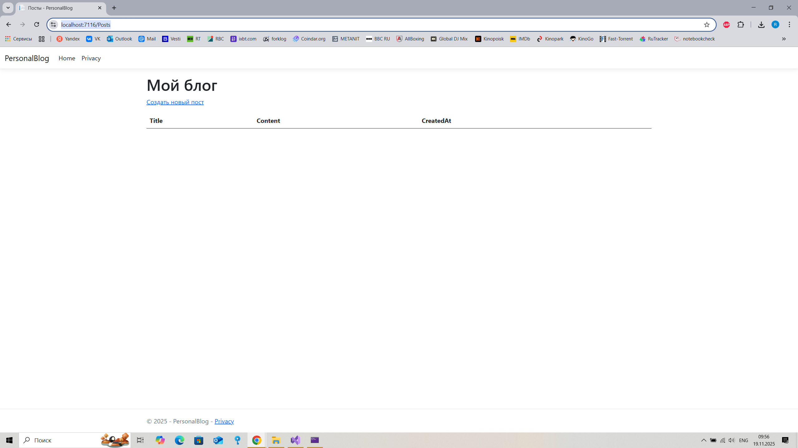
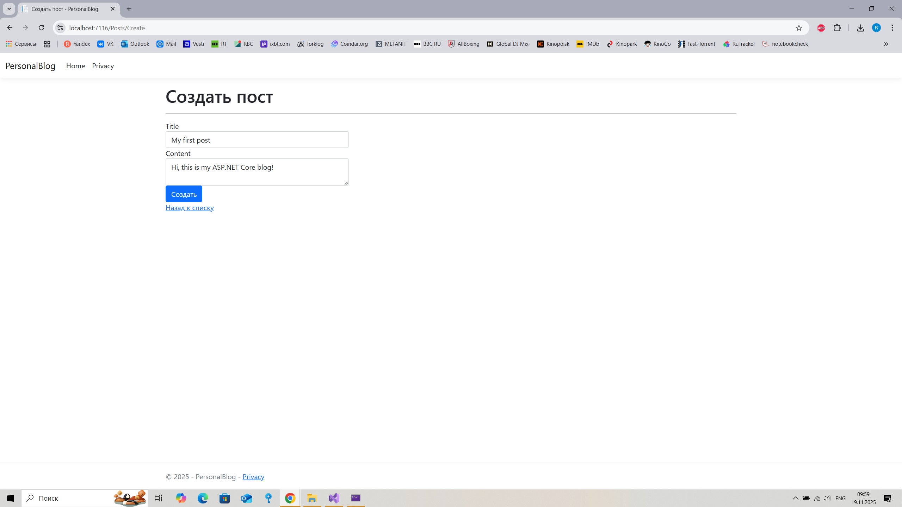
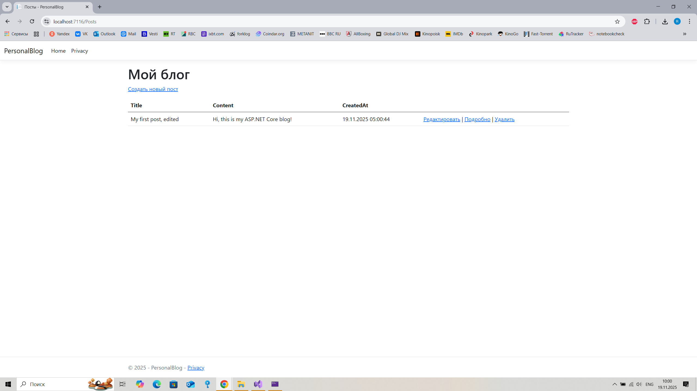

# Personal Blog

Полноценный блог с **CRUD-операциями** на **ASP.NET Core MVC**.

## Особенности
- Создание, редактирование, удаление постов
- Хранение в **SQL Server (LocalDB)**
- MVC + Entity Framework Core

## Технологии
- **ASP.NET Core MVC 8.0**
- **Entity Framework Core 8.0.10**
- **SQL Server**
- **Razor Views**

## Запуск
```bash
dotnet run
Откройте: https://localhost:7xxx/Posts
Скриншоты



